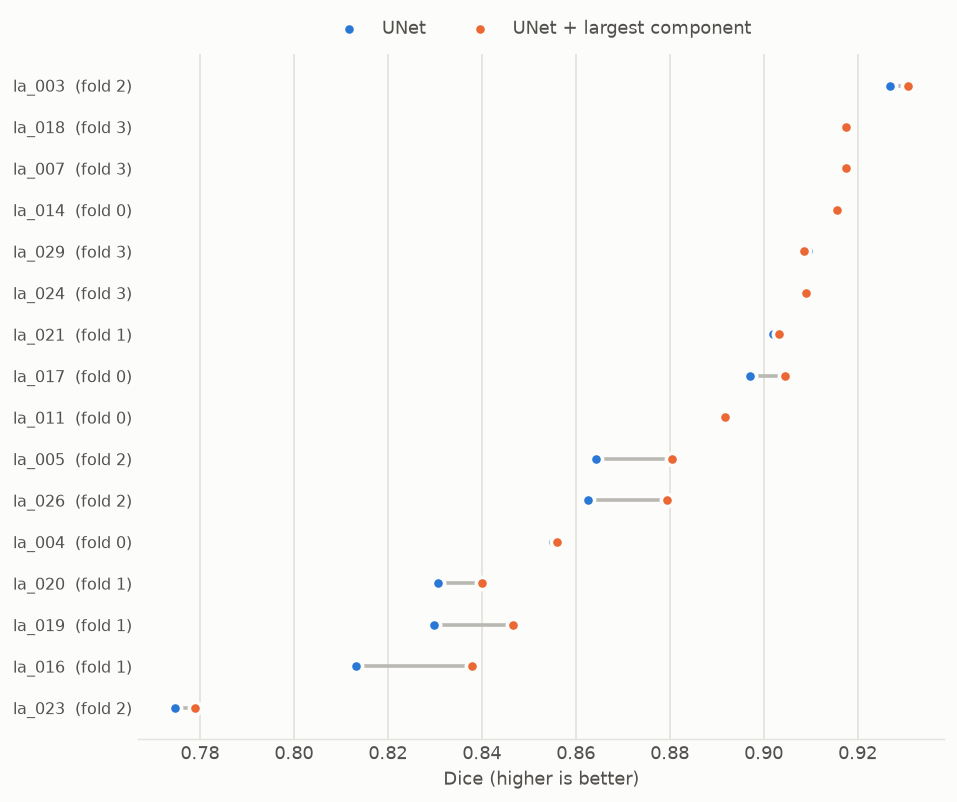
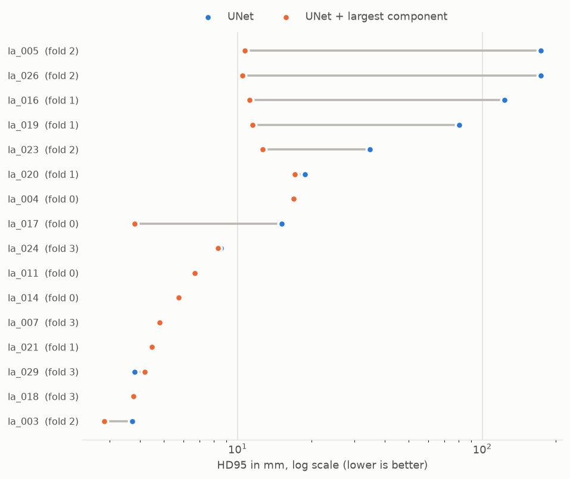
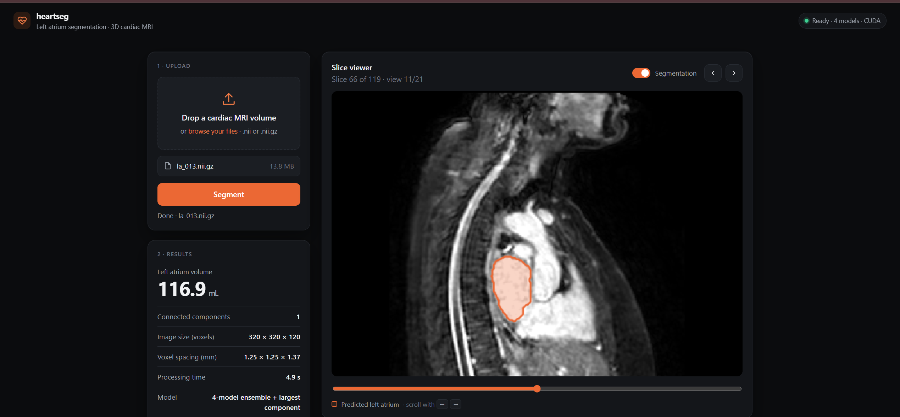

# heartseg

Reproducible 3D left atrium segmentation on cardiac MRI (Medical Segmentation Decathlon, Task02 Heart), built with PyTorch and MONAI.

The focus is on experimental rigor rather than leaderboard numbers: a frozen, unit-tested case-level split, cross-validation with bootstrap confidence intervals, per-case boundary metrics alongside Dice, documented error analysis, and a held-out test set evaluated exactly once with a pipeline fixed in advance.

## Headline result

Held-out test set (4 cases, evaluated once), ensemble of the four cross-validation models with largest-connected-component post-processing:

| Dice | HD95 | ASSD | NSD (2 mm) |
|---|---|---|---|
| **0.887** | **6.1 mm** | **1.5 mm** | **0.806** |

Cross-validation (16 cases, out-of-fold): Dice 0.882 ± 0.041, HD95 8.5 ± 4.7 mm. The test result is consistent with cross-validation.

## Dataset

MSD Task02 Heart: 20 labelled mono-modal 3D MRI volumes, single foreground class (left atrium), native voxel spacing 1.25 × 1.25 × 1.37 mm (verified on all image headers). The 10 official test volumes have no public labels and are not used.

| Split | Cases |
|---|---|
| Held-out test (evaluated once) | la_009, la_010, la_022, la_030 |
| 4-fold cross-validation | remaining 16 cases, 4 per fold |

The split is generated with a fixed seed by `medseg.splits`, saved to `configs/splits.json` and committed. Unit tests check that no case appears in more than one role.

## Method

| Component | Choice |
|---|---|
| Preprocessing | Native spacing 1.25 × 1.25 × 1.37 mm, z-score normalisation on nonzero voxels (MRI, no HU windowing) |
| Training samples | 96³ patches, foreground-biased sampling (1:1 positive/negative), flips, 90° rotations, intensity scale/shift |
| Model | MONAI 3D UNet (5 levels, residual units, instance norm) |
| Loss / optimiser | Dice + cross-entropy, AdamW (lr 1e-3), cosine schedule, mixed precision, 300 epochs |
| Model selection | Best checkpoint per fold by validation Dice |
| Inference | Sliding window over the full volume |
| Post-processing | Keep the largest connected component |
| Test-time model | Mean-softmax ensemble of the four fold models |
| Metrics (per case) | Dice, HD95, NSD at 2 mm; also IoU, precision, recall, ASSD, volume error, connected components |
| Aggregation | Mean ± SD and 95% percentile-bootstrap CI over cases |

Every decision made after seeing results is logged with its date and reason in [PROTOCOL.md](PROTOCOL.md). The final pipeline was frozen and committed before the test set was touched.

## Results

### Cross-validation (out-of-fold, 16 cases)

| Metric | UNet | UNet + largest component |
|---|---|---|
| Dice | 0.876 ± 0.045 | **0.882 ± 0.041** [0.862, 0.899] |
| HD95 (mm) | 42.3 ± 60.7 | **8.5 ± 4.7** [6.4, 10.7] |
| ASSD (mm) | 5.2 ± 5.7 | **1.9 ± 0.7** |
| NSD (2 mm) | 0.747 ± 0.117 | **0.769 ± 0.097** |
| Precision | 0.909 | 0.925 |
| Recall | 0.850 | 0.849 |
| Relative volume error | −6.4% | −7.9% |
| Connected components | 22.8 | 1 |

Per fold, with post-processing:

| Fold | Dice | HD95 (mm) | NSD |
|---|---|---|---|
| 0 | 0.892 | 8.3 | 0.771 |
| 1 | 0.857 | 11.1 | 0.700 |
| 2 | 0.867 | 9.2 | 0.743 |
| 3 | 0.913 | 5.3 | 0.863 |

### Held-out test set (4 cases, evaluated once)

| Model | Dice | HD95 (mm) | ASSD (mm) | NSD |
|---|---|---|---|---|
| **Ensemble (headline)** | **0.887** | **6.1** | **1.5** | **0.806** |
| Individual fold models, mean ± SD | 0.877 ± 0.009 | 6.8 ± 0.8 | 1.7 | 0.782 ± 0.017 |

| Case | Dice, individual models (range) | Dice, ensemble | Recall, ensemble | Volume error, ensemble |
|---|---|---|---|---|
| la_009 | 0.763 – 0.823 | 0.815 | 0.75 | −16% |
| la_010 | 0.875 – 0.909 | 0.906 | 0.94 | +8% |
| la_022 | 0.882 – 0.897 | 0.896 | 0.95 | +12% |
| la_030 | 0.915 – 0.931 | 0.930 | 0.95 | +4% |

The ensemble scored higher than the mean of the individual models on every test case. With four cases this is a consistent tendency, not a demonstrated improvement; the best single model (fold 0) performs about as well.

Per-case CSVs: [`results/`](results/) (cross-validation) and [`results/test/`](results/test/) (test set).





## Error analysis

**Distant false positives, removed by post-processing.** Without post-processing, several cases contained small spurious components far from the atrium (up to 26 per case; HD95 up to 173 mm) while Dice stayed above 0.85. Dice barely registers small distant blobs; HD95 does. Keeping the largest connected component reduced mean HD95 from 42.3 to 8.5 mm and ASSD from 5.2 to 1.9 mm. Recall was unchanged (0.850 → 0.849), showing that the removed components were false positives.

**Systematic under-segmentation.** Precision exceeds recall in most cases, and the predicted volume is on average 8% too small, up to 24–29% in the worst cross-validation cases (la_023, la_016, la_019) and 16% in test case la_009. The model is reliable where it predicts atrium but tends to leave parts out. In the overlays inspected, the missed regions are thin tubular extensions of the ground truth at the back of the atrium, consistent with the pulmonary vein junctions: a thin, variable and partly label-ambiguous region, since annotations include the veins to differing lengths.

**Model disagreement marks the hard case.** la_009 is under-segmented by all four fold models and is also where they disagree most (Dice 0.763 – 0.823). Disagreement between models is therefore a usable signal for which cases need human review, the basis for model-assisted annotation.

## Robustness to acquisition changes

Simulated scanner and protocol differences, applied to the 16 cross-validation cases (out-of-fold, final pipeline with post-processing). Each image is perturbed after resampling and before intensity normalisation; labels are untouched. Perturbations use [TorchIO](https://torchio.readthedocs.io); the analysis was specified in PROTOCOL.md before running.

| Perturbation | Severity | Dice | Δ Dice vs clean | Worst case | HD95 (mm) |
|---|---|---|---|---|---|
| None (clean) | – | 0.882 | – | 0.779 | 8.5 |
| Gaussian noise (σ, fraction of foreground SD) | 0.05 / 0.1 / 0.2 | 0.882 / 0.879 / 0.872 | −0.001 / −0.003 / −0.011 | 0.733 at 0.2 | 8.5 – 8.9 |
| Motion (degrees and mm) | 2 / 5 / 10 | 0.881 / 0.880 / 0.882 | ≤ 0.002 | 0.776 | 8.4 – 8.6 |
| Thicker slices along axis 2 | 2× / 3× / 4× | 0.881 / 0.882 / 0.877 | −0.002 / −0.001 / −0.006 | 0.792 | 8.0 – 8.1 |
| Gamma (contrast) | −0.3 / +0.3 | 0.869 / 0.877 | −0.013 / −0.005 | 0.748 | 8.8 – 9.0 |
| **Bias field** | 0.2 / 0.4 / 0.6 | 0.873 / 0.828 / **0.739** | −0.009 / −0.055 / **−0.143** | **0.000** at 0.6 | 9.0 / 10.3 / **18.6** |

**Robust to noise, motion and reduced through-plane resolution.** Even 4× thicker slices or 10° motion change mean Dice by less than 0.01.

**Sensitive to intensity inhomogeneity (bias field).** Moderate bias (0.4) breaks two of sixteen cases (la_016: 0.84 → 0.52; la_007: 0.92 → 0.61); strong bias (0.6) causes a complete failure on la_007 (Dice 0) and a severe one on la_016 (0.23). The failure is case-dependent: most cases stay above 0.85 even at 0.6. Global z-score normalisation cannot undo a smooth spatial brightness variation, and the model partly relies on blood-pool brightness. Bias fields from receiver coils are common in cardiac MRI and differ between scanners, so this is the most relevant robustness gap. Likely remedies are bias-field augmentation during training or N4 bias-field correction in preprocessing; neither was applied, since the test set has been used.

**Post-processing can amplify a failure.** In the la_007 failure the single kept component lies entirely outside the atrium (precision 0): under strong bias the largest predicted region was not the atrium, and keeping only the largest component discarded everything else.

**A confound found and fixed in the analysis itself.** In a first run, noise and motion appeared to *improve* Dice slightly at every severity. They had put non-zero values into the zero-valued area outside the scanned field, which changed the voxels used by the nonzero-only intensity normalisation. After keeping that area at zero (unit-tested), the apparent improvement disappeared and noise showed the expected small, dose-dependent drop. Details in PROTOCOL.md.

Severity levels are a reasonable grid, not calibrated against real scanner differences; the results describe relative sensitivity, not expected performance on a specific external dataset.

Per-case results: [`results/robustness/`](results/robustness/).

## Web app and inference service

The final pipeline (ensemble of the four fold models with largest-component post-processing) is served by a small FastAPI app with a browser interface.



Upload a cardiac MRI volume (`.nii` or `.nii.gz`) and the app shows the predicted left atrium volume, image size, voxel spacing and processing time, a slice viewer with the segmentation overlay that can be switched on and off, an overview in three planes, and a download of the mask as NIfTI. The mask is returned in the original image space (same shape and affine as the input), so it overlays directly on the scan in 3D Slicer or ITK-SNAP.

```bash
uvicorn medseg.api:app --host 127.0.0.1 --port 8000    # needs the trained checkpoints/
```

| Endpoint | Purpose |
|---|---|
| `GET /` | Web interface |
| `GET /health` | Status: number of models, device, post-processing |
| `POST /segment` | Upload a NIfTI volume; returns the mask (`.nii.gz`), or a JSON summary with `?output=json` |
| `GET /docs` | Interactive API documentation |

```bash
curl -F "file=@la_001.nii.gz" "http://127.0.0.1:8000/segment?output=json"
curl -F "file=@la_001.nii.gz" http://127.0.0.1:8000/segment -o la_001_mask.nii.gz
```

A container image is defined in `Dockerfile.serve` (CPU inference; model weights are mounted, not baked in):

```bash
docker build -f Dockerfile.serve -t heartseg-serve .
docker run --rm -p 8000:8000 -v "$(pwd)/checkpoints:/app/checkpoints" heartseg-serve
```

Uploads are processed locally and not stored. This is a research prototype trained on 16 public scans: not a medical device and not for clinical decisions.

## Lessons learned: a preprocessing bug

The first version (v1) resampled every volume to an assumed spacing of 1.25 × 1.25 × 2.7 mm instead of the native 1.25 × 1.25 × 1.37 mm, halving the resolution along one axis for both images and labels. It produced Dice 0.781 ± 0.194, with one fold failing badly (Dice 0.51, predictions fragmented into hundreds of pieces).

The bug was found during error analysis: overlays looked anatomically implausible, which prompted a check of the raw image headers. After fixing the spacing and retraining all folds with otherwise identical settings (v2), Dice rose to 0.876 ± 0.045, the failing fold recovered, recall rose from 0.76 to 0.85 and the spread across cases dropped by a factor of four. The v1 runs are kept and labelled in PROTOCOL.md; they are not used for any reported result. The lesson: verify data properties from the data, never from memory, and treat implausible errors as a prompt to check the pipeline before the model.

The overlays also showed that the image headers are nominally RAS but do not match the true anatomy, so overlay panels are labelled by array axis rather than anatomical plane.

## Limitations

- Small data: 16 training and validation cases, 4 test cases. Confidence intervals are wide, and test differences of a few Dice points are within noise.
- Single dataset and acquisition protocol; no external validation on other scanners or centres.
- Model selection and post-processing were chosen on cross-validation results. They were fixed before testing, but the cross-validation numbers are slightly optimistic for that reason.
- Pulmonary vein extent in the ground truth varies between cases, which limits how far boundary metrics can be pushed in that region.

## Reproduce

```bash
python -m venv .venv && source .venv/bin/activate     # Windows: .venv\Scripts\activate
pip install torch --index-url https://download.pytorch.org/whl/cu121   # pick your CUDA build
pip install -e ".[dev]"
pytest

python -m medseg.download                              # data/Task02_Heart
python -m medseg.train fold=0                          # repeat for folds 1-3
python -m medseg.eval fold=all                         # CV per-case CSV + overlays
python -m medseg.eval fold=all eval.postprocess=lcc
python -m medseg.report outputs/eval/unet_foldall_val.csv \
    outputs/eval/unet_foldall_val_lcc.csv --labels "UNet" "UNet + largest component"
python -m medseg.eval fold=ensemble split=test eval.postprocess=lcc   # test set, once
python -m medseg.robustness                             # robustness analysis (CV cases)
uvicorn medseg.api:app --host 127.0.0.1 --port 8000      # web app at http://127.0.0.1:8000
mlflow ui --backend-store-uri sqlite:///mlflow.db       # training curves
```

All commands run from the repo root. Settings live in `configs/default.yaml` and can be overridden on the command line, e.g. `model.name=segresnet`.

## Project structure

```
configs/          default.yaml (all settings), splits.json (frozen split)
src/medseg/
  splits.py       seeded case-level split generation
  data.py         dataset discovery, MONAI transforms, data loaders
  download.py     dataset download via MONAI
  models.py       model factory (UNet, SegResNet)
  train.py        training loop with MLflow tracking
  eval.py         per-case metrics, post-processing, ensembling, overlays, NIfTI export
  report.py       results tables and figures
  robustness.py   simulated acquisition changes (TorchIO) and paired evaluation
  inference.py    load the fold models once, segment a new NIfTI, map back to image space
  api.py          FastAPI service: /, /health, /segment
  ui.py           web interface (plain HTML, CSS, JavaScript)
  viz.py          figures and previews
  utils.py        seeding, git provenance
tests/            unit tests (splits, data, models, metrics, post-processing, ensembling,
                  robustness, inference, API)
results/          committed per-case CSVs, summary and figures; results/test/ for the test set,
                  results/robustness/ for the robustness analysis
PROTOCOL.md       experimental protocol and dated changelog
```

Code quality: ruff and pre-commit hooks, GitHub Actions CI (lint and tests), Dockerfile for
tests and `Dockerfile.serve` for the web app.

## Possible extensions

- Bias-field augmentation or N4 correction to close the robustness gap above (needs new held-out data to evaluate)
- Hole filling as additional post-processing (residual internal false negatives, e.g. la_016)
- Near-duplicate and data quality audit
- SegResNet and nnU-Net comparison on the same frozen folds
- Uncertainty from ensemble disagreement for review prioritisation, shown in the web app

## Data and acknowledgements

Data: Medical Segmentation Decathlon, Task02 Heart (CC BY-SA 4.0), originally from the King's College London left atrial segmentation challenge.

- Antonelli et al., *The Medical Segmentation Decathlon*, Nature Communications 13, 4128 (2022).
- Simpson et al., *A large annotated medical image dataset for the development and evaluation of segmentation algorithms*, arXiv:1902.09063 (2019).
- Tobon-Gomez et al., *Benchmark for algorithms segmenting the left atrium from 3D CT and MRI datasets*, IEEE TMI 34(7) (2015).

Built with [MONAI](https://monai.io) and PyTorch.
