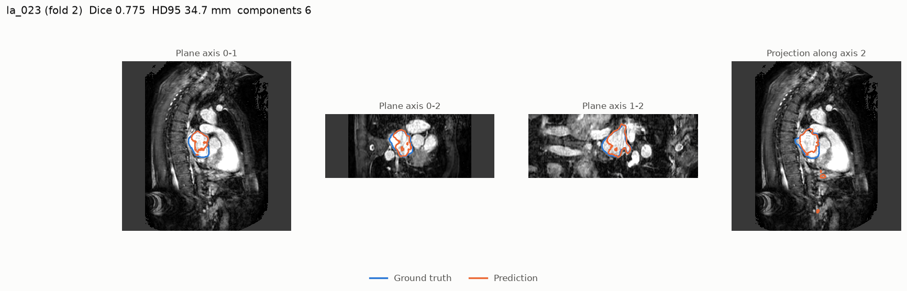
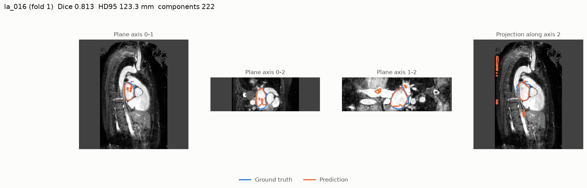
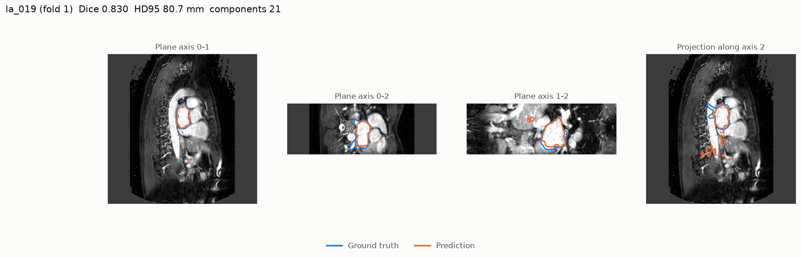
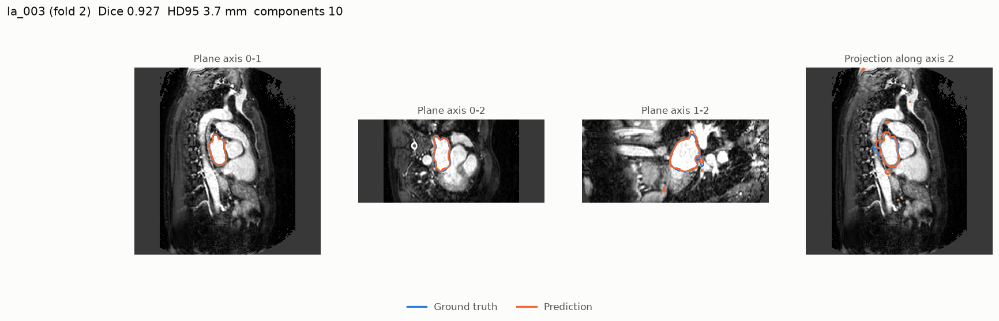
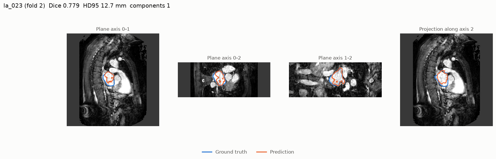
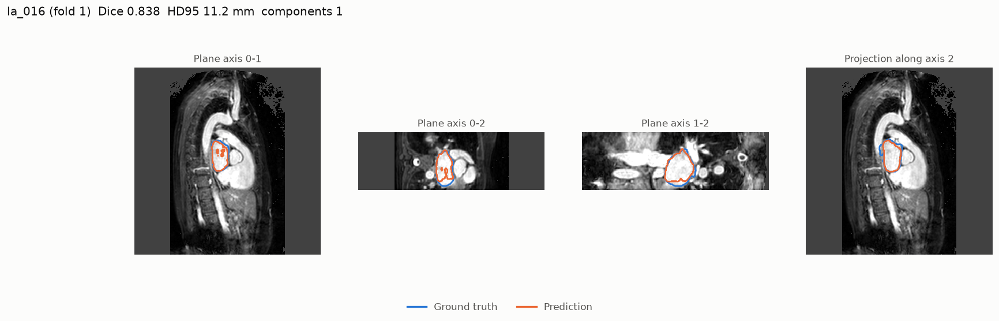
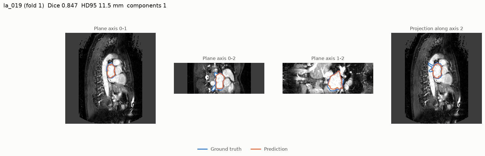
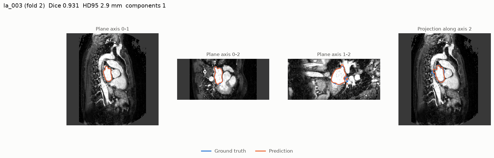

# Results

## UNet

n = 16 cases

| Metric | Mean ± SD | 95% CI (bootstrap) | Finite cases |
|---|---|---|---|
| dice | 0.876 ± 0.045 | [0.854, 0.895] | 16/16 |
| iou | 0.782 ± 0.069 | [0.748, 0.812] | 16/16 |
| precision | 0.909 ± 0.033 | [0.894, 0.925] | 16/16 |
| recall | 0.850 ± 0.079 | [0.809, 0.884] | 16/16 |
| hd95_mm | 42.3 ± 60.7 | [15.9, 73.0] | 16/16 |
| assd_mm | 5.2 ± 5.7 | [2.7, 8.1] | 16/16 |
| nsd | 0.747 ± 0.117 | [0.693, 0.797] | 16/16 |
| abs_vol_err_ml | 8.9 ± 8.4 | [5.2, 13.1] | 16/16 |
| rel_vol_err | -0.064 ± 0.099 | [-0.113, -0.020] | 16/16 |
| n_components | 22.75 ± 53.74 | [6.50, 50.88] | 16/16 |

### Per fold

| Fold | Dice | HD95 (mm) | NSD | Mean components |
|---|---|---|---|---|
| 0 | 0.890 | 11.1 | 0.764 | 4.00 |
| 1 | 0.844 | 56.8 | 0.656 | 65.00 |
| 2 | 0.857 | 96.2 | 0.706 | 17.00 |
| 3 | 0.913 | 5.2 | 0.862 | 5.00 |

### Worst cases by Dice

| Case | Fold | Dice | HD95 (mm) | NSD | Components | Rel. volume error |
|---|---|---|---|---|---|---|
| la_023 | 2 | 0.775 | 34.7 | 0.616 | 6 | -28.3% |
| la_016 | 1 | 0.813 | 123.3 | 0.533 | 222 | -21.0% |
| la_019 | 1 | 0.830 | 80.7 | 0.571 | 21 | -20.2% |
| la_020 | 1 | 0.831 | 18.8 | 0.687 | 12 | -6.4% |
| la_004 | 0 | 0.855 | 16.9 | 0.680 | 6 | -1.7% |

## UNet + largest component

n = 16 cases

| Metric | Mean ± SD | 95% CI (bootstrap) | Finite cases |
|---|---|---|---|
| dice | 0.882 ± 0.041 | [0.862, 0.899] | 16/16 |
| iou | 0.792 ± 0.063 | [0.760, 0.818] | 16/16 |
| precision | 0.925 ± 0.038 | [0.907, 0.943] | 16/16 |
| recall | 0.849 ± 0.079 | [0.809, 0.884] | 16/16 |
| hd95_mm | 8.5 ± 4.7 | [6.4, 10.7] | 16/16 |
| assd_mm | 1.9 ± 0.7 | [1.6, 2.2] | 16/16 |
| nsd | 0.769 ± 0.097 | [0.724, 0.811] | 16/16 |
| abs_vol_err_ml | 10.3 ± 9.4 | [6.3, 15.2] | 16/16 |
| rel_vol_err | -0.079 ± 0.108 | [-0.133, -0.031] | 16/16 |
| n_components | 1.00 ± 0.00 | [1.00, 1.00] | 16/16 |

### Per fold

| Fold | Dice | HD95 (mm) | NSD | Mean components |
|---|---|---|---|---|
| 0 | 0.892 | 8.3 | 0.771 | 1.00 |
| 1 | 0.857 | 11.1 | 0.700 | 1.00 |
| 2 | 0.867 | 9.2 | 0.743 | 1.00 |
| 3 | 0.913 | 5.3 | 0.863 | 1.00 |

### Worst cases by Dice

| Case | Fold | Dice | HD95 (mm) | NSD | Components | Rel. volume error |
|---|---|---|---|---|---|---|
| la_023 | 2 | 0.779 | 12.7 | 0.630 | 1 | -29.3% |
| la_016 | 1 | 0.838 | 11.2 | 0.628 | 1 | -26.3% |
| la_020 | 1 | 0.840 | 17.2 | 0.720 | 1 | -10.1% |
| la_019 | 1 | 0.847 | 11.5 | 0.613 | 1 | -23.8% |
| la_004 | 0 | 0.856 | 16.9 | 0.684 | 1 | -1.9% |

## Figures

**la_023** (UNet)

**la_016** (UNet)

**la_019** (UNet)

**la_003** (UNet)

**la_023** (UNet + largest component)

**la_016** (UNet + largest component)

**la_019** (UNet + largest component)

**la_003** (UNet + largest component)

