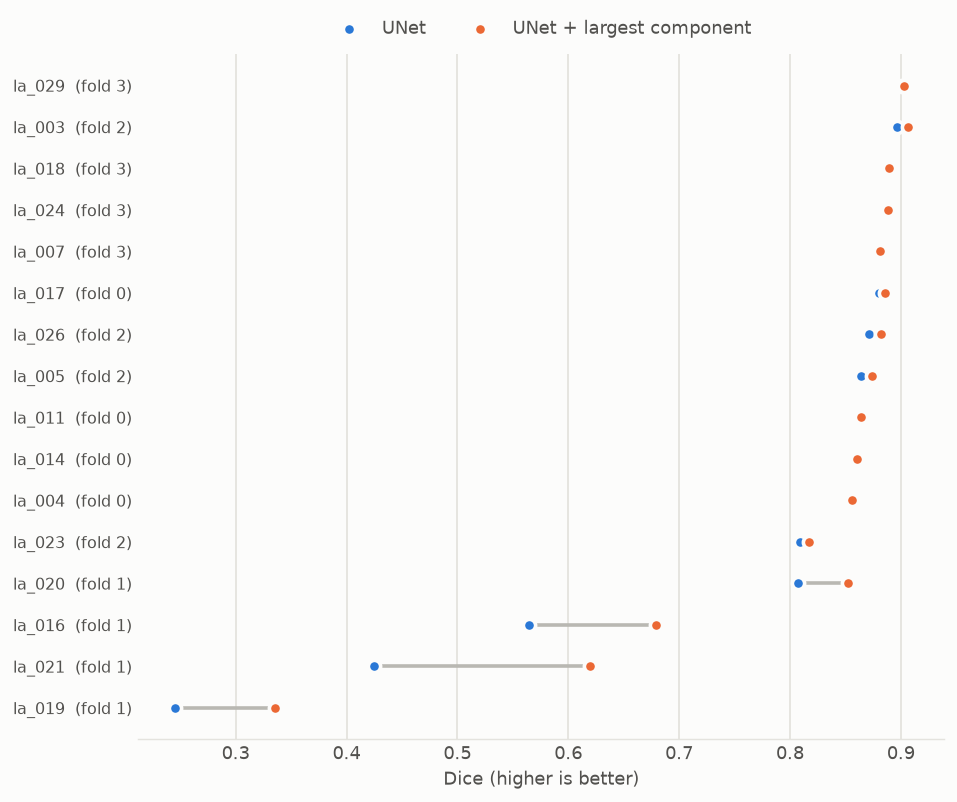
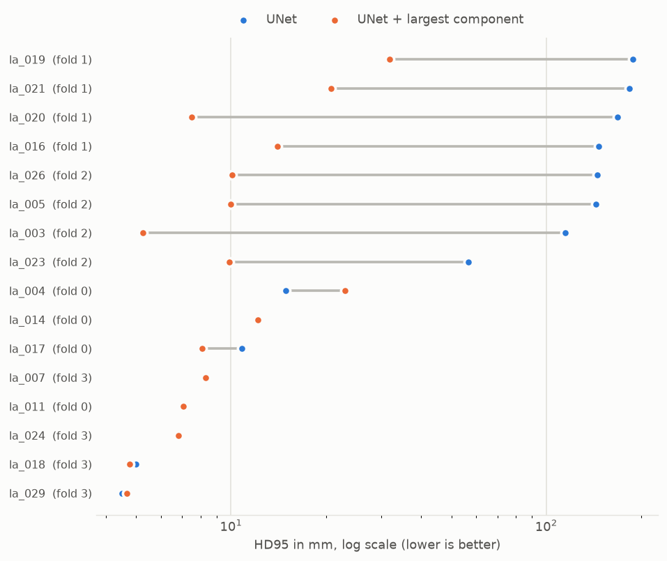
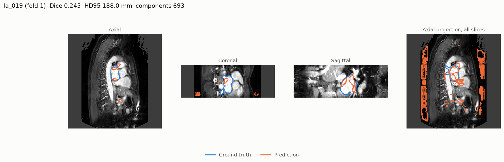
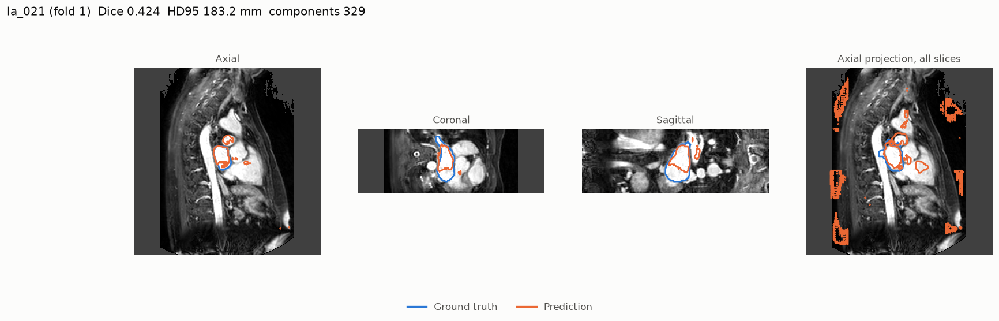
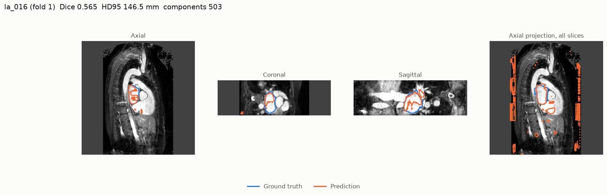
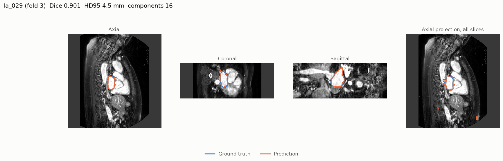
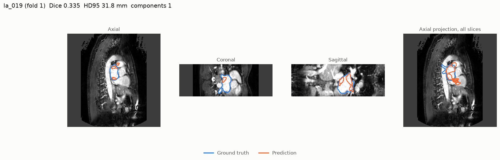
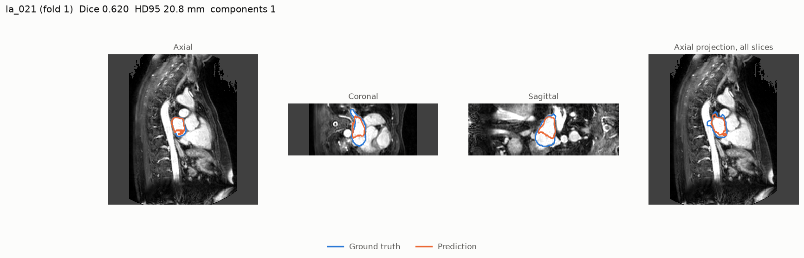
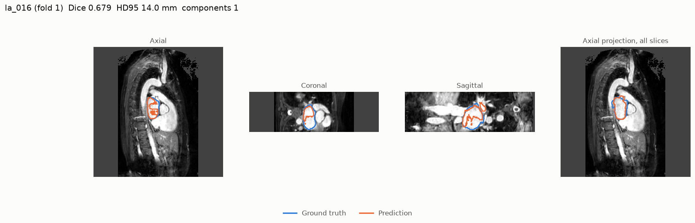
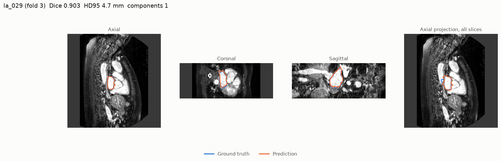

# Results

## UNet

n = 16 cases

| Metric | Mean ± SD | 95% CI (bootstrap) | Finite cases |
|---|---|---|---|
| dice | 0.781 ± 0.194 | [0.679, 0.860] | 16/16 |
| iou | 0.672 ± 0.210 | [0.564, 0.758] | 16/16 |
| precision | 0.808 ± 0.208 | [0.698, 0.893] | 16/16 |
| recall | 0.760 ± 0.191 | [0.662, 0.836] | 16/16 |
| hd95_mm | 76.0 ± 75.3 | [41.0, 112.6] | 16/16 |
| assd_mm | 15.1 ± 23.8 | [5.3, 27.8] | 16/16 |
| nsd | 0.576 ± 0.217 | [0.466, 0.665] | 16/16 |
| abs_vol_err_ml | 10.8 ± 7.8 | [7.2, 14.7] | 16/16 |
| rel_vol_err | -0.051 ± 0.116 | [-0.104, 0.004] | 16/16 |
| n_components | 107.25 ± 210.61 | [21.00, 216.95] | 16/16 |

### Per fold

| Fold | Dice | HD95 (mm) | NSD | Mean components |
|---|---|---|---|---|
| 0 | 0.865 | 11.2 | 0.646 | 3.50 |
| 1 | 0.510 | 171.5 | 0.265 | 401.00 |
| 2 | 0.860 | 115.2 | 0.647 | 17.50 |
| 3 | 0.890 | 6.2 | 0.746 | 7.00 |

### Worst cases by Dice

| Case | Fold | Dice | HD95 (mm) | NSD | Components | Rel. volume error |
|---|---|---|---|---|---|---|
| la_019 | 1 | 0.245 | 188.0 | 0.086 | 693 | -15.0% |
| la_021 | 1 | 0.424 | 183.2 | 0.158 | 329 | +18.9% |
| la_016 | 1 | 0.565 | 146.5 | 0.250 | 503 | -9.5% |
| la_020 | 1 | 0.807 | 168.4 | 0.565 | 79 | +14.3% |
| la_023 | 2 | 0.809 | 56.5 | 0.589 | 23 | -24.2% |

## UNet + largest component

n = 16 cases

| Metric | Mean ± SD | 95% CI (bootstrap) | Finite cases |
|---|---|---|---|
| dice | 0.812 ± 0.150 | [0.730, 0.869] | 16/16 |
| iou | 0.704 ± 0.171 | [0.613, 0.771] | 16/16 |
| precision | 0.899 ± 0.076 | [0.858, 0.929] | 16/16 |
| recall | 0.760 ± 0.191 | [0.662, 0.836] | 16/16 |
| hd95_mm | 11.5 ± 7.6 | [8.4, 15.3] | 16/16 |
| assd_mm | 2.9 ± 2.3 | [2.0, 4.1] | 16/16 |
| nsd | 0.623 ± 0.162 | [0.540, 0.691] | 16/16 |
| abs_vol_err_ml | 18.4 ± 20.8 | [9.9, 29.2] | 16/16 |
| rel_vol_err | -0.160 ± 0.204 | [-0.266, -0.073] | 16/16 |
| n_components | 1.00 ± 0.00 | [1.00, 1.00] | 16/16 |

### Per fold

| Fold | Dice | HD95 (mm) | NSD | Mean components |
|---|---|---|---|---|
| 0 | 0.867 | 12.6 | 0.650 | 1.00 |
| 1 | 0.621 | 18.5 | 0.415 | 1.00 |
| 2 | 0.870 | 8.8 | 0.679 | 1.00 |
| 3 | 0.890 | 6.1 | 0.748 | 1.00 |

### Worst cases by Dice

| Case | Fold | Dice | HD95 (mm) | NSD | Components | Rel. volume error |
|---|---|---|---|---|---|---|
| la_019 | 1 | 0.335 | 31.8 | 0.193 | 1 | -65.3% |
| la_021 | 1 | 0.620 | 20.8 | 0.393 | 1 | -50.2% |
| la_016 | 1 | 0.679 | 14.0 | 0.420 | 1 | -41.6% |
| la_023 | 2 | 0.817 | 9.9 | 0.615 | 1 | -26.0% |
| la_020 | 1 | 0.852 | 7.5 | 0.653 | 1 | +3.0% |

## Figures

**la_019** (UNet)

**la_021** (UNet)

**la_016** (UNet)

**la_029** (UNet)

**la_019** (UNet + largest component)

**la_021** (UNet + largest component)

**la_016** (UNet + largest component)

**la_029** (UNet + largest component)

